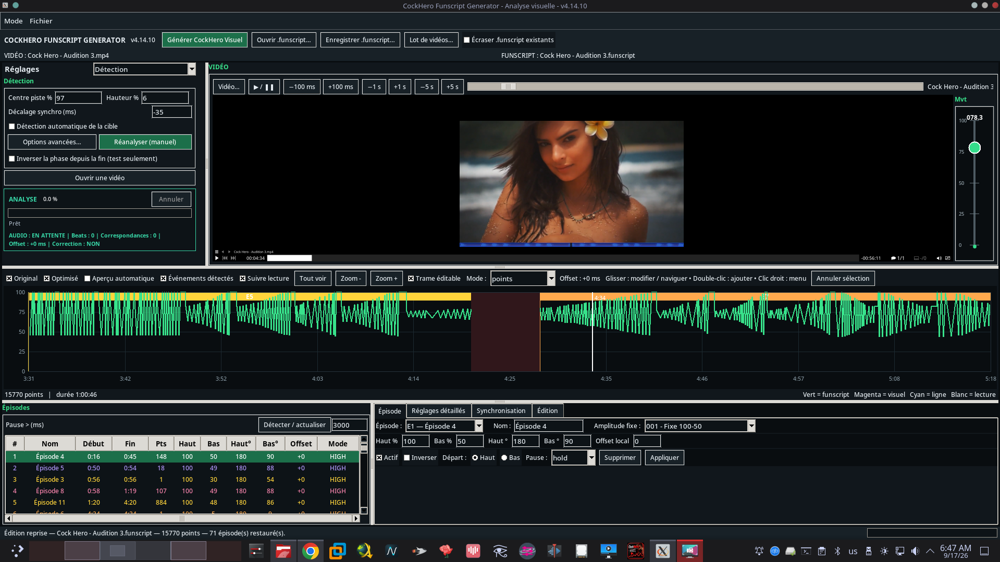

# CockHero Funscript Generator

Advanced Python tool for creating, analyzing and optimizing `.funscript` files, including CockHero-oriented rhythmic generation and visual analysis.




## Current version

**v4.15.1**

Main standalone script:

`CockHero_Funscript_Generator_v4.15.1-English-Code-Comments.py`

The application now provides a selectable **Français / English** interface from the top of the GUI. The selected language is retained, and the source-code comments are maintained in English for easier collaboration.

A modular API is available under `src/cockhero_generator/` and is synchronized with the current standalone release.

## Modular structure

- `runtime.py` — compatibility loader for the current standalone implementation
- `core.py` — funscript processing, normalization, cycles, gaps and fades
- `patterns.py` — CockHero rhythmic generation, episode presets and movement patterns
- `media.py` — video duration, MPV, audio beat and phase helpers
- `gui.py` — graphical interface entry point
- `__main__.py` — `python -m cockhero_generator` entry point

## Features

- Selectable French / English interface
- Graphical interface built with Tkinter
- Funscript analysis and optimization
- Video-based funscript generation
- CockHero BPM-based rhythmic generation
- Progressive start handling
- Automatic dead-time detection and filling
- Previous/next cycle mixing for gaps
- Smooth gap transitions
- End-of-video progressive fade
- General amplitude adjustment
- Detection/removal of repetitive fallback blocks
- 50 optional movement patterns
- Fixed and rhythmic episode presets
- Visual analysis tools
- Automatic video duration detection through `ffprobe`
- English source-code comments for collaboration

## Requirements

- Python 3.10+
- NumPy
- FFmpeg / ffprobe
- Tkinter

On Debian/Ubuntu:

```bash
sudo apt install python3-tk ffmpeg
python3 -m pip install numpy
```

## Run standalone

```bash
python3 CockHero_Funscript_Generator_v4.15.1-English-Code-Comments.py
```

## Run as a module

From an installed/editable checkout:

```bash
python3 -m pip install -e .
cockhero-funscript-generator
```

or:

```bash
python3 -m cockhero_generator
```

## Notes

The application works with `.funscript` files and supported video files in the selected/current working directory. Keep backups of original scripts before batch processing.

## Version history

### v4.15.1

- Selectable French / English interface at the top of the GUI
- Language selection retained between sessions
- Source-code comments standardized in English
- Modular package metadata and runtime synchronized with v4.15.1
- Both application screenshots displayed, with the red interface first

### v4.14.9

- CockHero rhythmic generation and episode pattern support
- Visual analysis workflow
- Progressive movement generation and transition handling
- Expanded movement/pattern controls
- Modular `src/cockhero_generator/` API introduced

## Author

st3ph666
